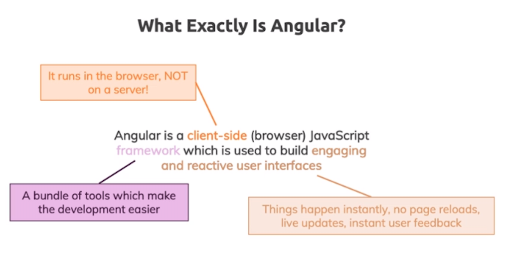
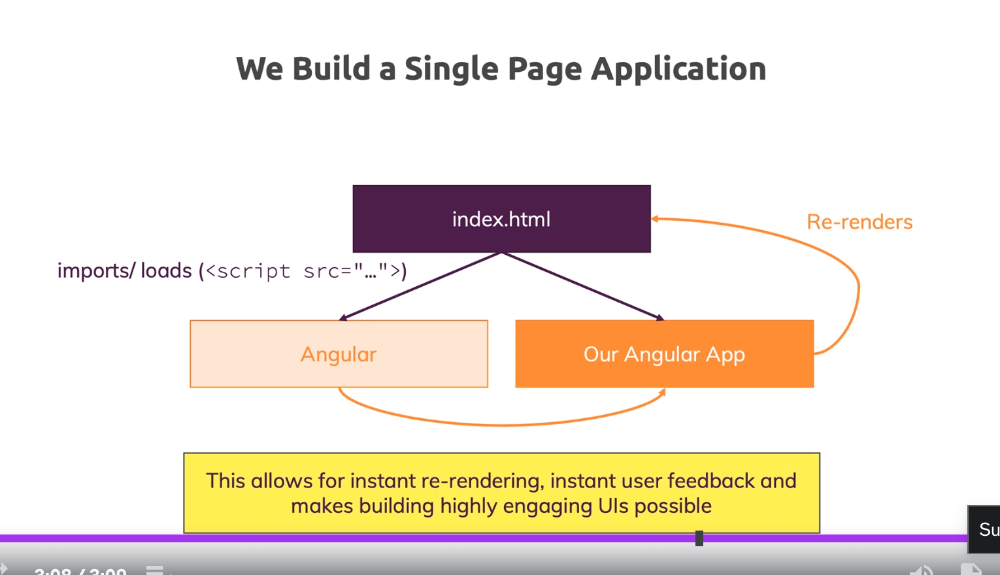
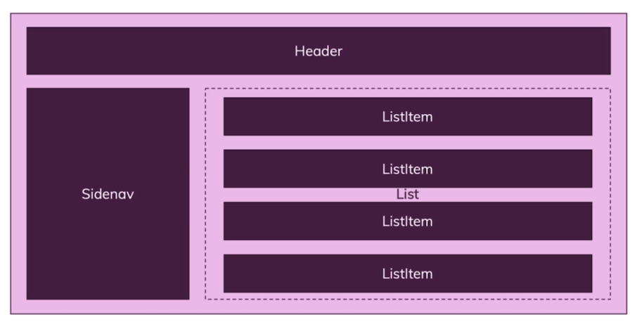

# An Angular refresher

## What's Angular?



What exactly is Angular? Angular is a client-side, which means it runs in the browser, Javascript framework which is used to build engaging and reactive user interfaces.

This is a definition we could come up with but what exactly does it mean? Well the first important part is that it's a client-side Javascript framework, that means it runs in the browser, not on the server. It's not using NodeJS or any other server-side programming language, it uses Javascript as it runs in the browser. Well actually as it will turn out, you will learn that Angular uses Typescript which is a superset to Javascript but that is just so that we as a developer have a more convenient way of developing Angular applications. We will in the end just get a bunch of Javascript code even though we don't write that Javascript code directly.

The next important part is that it's a framework and that simply means it's a set of rules and utility tools and utility helpers which we use in our Javascript code or our Typescript code which we write that makes our life easier and that will take care about things like sending HTTP requests, routing, so rendering different pages, different content depending on where the user went in our application and managing the state, the data our application needs. This would all be possible without Angular or without a framework like Angular too but using a framework simply makes it easier and always keep in mind, in the end what we will get is a bunch of Javascript code that we could have written like this but that is very complex and very sophisticated and hence is easier to write when using a framework like Angular.

And last but not least, we are using frameworks or tools like Angular to build engaging and reactive user interfaces and that is important. We don't use Angular to build very trivial applications most of the time because it really shines when we have more complex applications, more complex web apps, more complex user interfaces where a lot of things are happening and where we therefore want to control a lot of stuff with Javascript which allows us to update things in the browser without reloading the page, without fetching a new HTML page and where at the same time all this complexity means that we would have to write very complex Javascript code and that is where a framework like Angular simply helps us a lot.

## Angular SPAs & Ionic



Now one important thing about Angular is that typically, we use it to build web applications, so websites that run in the browser. In this course however, we use it to build native mobile applications as well, we do this with the help of the extra tool we're covering in this course, Ionic.

Now if we take a step back and we have a look at a regular web application built with Angular, then there we typically build a so-called single page application and that simply means that we only have one single HTML page which we really create and which we serve on our web server to our clients, our users visiting the page in their browser and on this HTML page, we load the Angular script and the Angular script is not just the framework script, it is our code built with Angular as well. Because we will use a project setup which actually gives us quite a nice way of building our Angular application, writing our code in a very structured and easy to read way and it will then take all this code which uses Typescript as I mentioned before, which does not run in the browser but it will compile Typescript to Javascript and bundle up all our code, so our own application logic as well as the Angular framework logic, so all these utility functions and so on, all that will be bundled up and will be imported in that single `index.html` file. And single page application then means that Angular will take care about constantly re-rendering the user interface, so what the user sees, re-rendering all these HTML elements so that to the user, it can definitely seem like we are using multiple pages but technically, we control all that through Javascript and the huge advantage of that is the performance, the speed because Javascript runs in the browser, it even works if we temporarily lose our internet connection and more than that, it happens instantly. We don't need to download anything from a server other than this initial page, thereafter everything can be re-rendered quickly and that of course feels good to the user because it's very reactive, it's the feeling we know from mobile apps typically where we also can press and tap stuff and things change instantly and if we happen to reach out to a server because we maybe want to download new data from a database, we do this behind the scenes and Angular allows us to achieve the same in a web app. And that of course makes it a perfect candidate to be used together with Ionic to then build a real native mobile app as well but still use our Angular knowledge to build all our business logic, all the logic we want to execute in our application.

## Understanding **Components**



Now one core idea that is built into Angular the framework is that we build our application with so-called components and what does this mean? Well let's have a look at a web page, how it could look like. Let's say we have a page which has a header, maybe a side navigation bar and then maybe an area with a couple of list items and obviously, you will find many pages that have a pattern like this or some related pattern. Now clearly, we can think of all these pieces as individual components which we then take to compose a rich user interface. We have a header component, we have a side nav component, we have our list item components and on the list item component, we can already see one advantage of thinking in components, if we build such components with Angular and I will show you how to do that with Angular in a second, then we only need to set up the general logic and the look for such a list item once and we can reuse it in our application, like on this screen where I use it four times and that's the idea behind component driven development. We see that in a lot of frameworks and a lot of tools and Angular is no exception, there we think in components too because it allows us to reuse code and define logic once and then use it as often as we want to.

## Installing Angular with the CLI

Install Angular:

``` bash
npm install -g @angular/cli
```

Create an Angular sample app:

``` bash
cd workspace
ng new ng-refresher # ng-refresher is the project name

? Would you like to add Angular routing? No
? Which stylesheet format would you like to use? CSS
```

Use VS Code as source code editor, with extensions:

- Angular essentials
- Material icons
- Angular official extension

To start to serve Angular:

``` bash
ng serve -o 
# -o, --open Opens the url in default browser.
```

## Understanding the folder structure

- _node_modules_: all the dependencies and libraries of the project, such as everything related to Angular dependencies, TypeScript... It is managed through npm.
- _src_: the entire source code of our application. In the _app_ subdirectory, you will find the source code of the main component of the application.
  - _app_: the entire source code of the main component.
    - Component's style sheets, which only affect this main component.
    - Template or HTML view.
    - `app.component.spec.ts`: unit test file for the main component.
    - `app.component.ts`: source code of the component.
    - `app.module.ts`: repository or container where our components, pipes, service classes, modules, etc. are registered. [Introduction to modules](https://angular.io/guide/architecture-modules#introduction-to-modules).
  - _assets_: directory where all the static content of our application is stored.
  - _environments_: environments of our application. By default, development or production.
  - `index.html`: root HTML file of our application.
  - `main.ts`: main class of our application, which bootstraps our application (App Module).
  - `polyfills.ts`: configuration file to increase the compatibility of our application.
  - `test.ts`: required by Karma, it is the configuration file for the test runner.
- `.editorconfig`: editor configuration.
- `angular.json`: main configuration file of the Angular project.
  - Project name.
  - `sourceRoot`: root folder.
  - `build`: information for generating the project.
  - `polyfills`: compatibility with all browsers.
  - `assets`: static resources of our site.
  - `styles`: style sheets to be included in our site when it starts.
  - `scripts`: JS scripts to be included in our site when it starts.
- `package.json`: npm configuration. It contains the project name, version, scripts, dependencies...
  - `dependencies`: production dependencies.
  - `devDependencies`: development dependencies.
- `README.md`: a brief user manual about the application.
- `tsconfig.json`: TypeScript configuration file. It helps us with compilation alerts during TypeScript code writing.

## The App Component

``` ts
import { Component } from '@angular/core';

@Component({
  selector: 'app-root',
  templateUrl: './app.component.html',
  styleUrls: ['./app.component.css']
})
export class AppComponent {
  title = 'ng-refresher';
}
```

We're almost done going through that startup process and I know that this is a lot of new knowledge to digest but it's important to have an idea of the big picture and of what happens here in general. So I left when I pointed at this app component which seems to be a somewhat important component in our Angular app. Well therefore let's have a look at it and remember that we are importing it from ./app.component, so from this file. Now in here what you can see is again a class which we export with that app component name we are importing in app module and just as our app module, the app component has a decorator but here it's not the ngModule decorator but the component decorator which again is imported from Angular, from the Angular framewore, here from angular/core and if you're wondering how you can know from which part of Angular you can import what, it's basically the same set of features all the time, so you will learn it throughout this course, throughout this refresher of course. Now we add this decorator to this class for a similar reason as we added @ngModule to this class in the app module, to provide metadata behind the scenes which allows Angular to treat this code in a certain way and execute it correctly in our browser so to say because you always have to keep in mind that we write the code here in a relatively structured and easy-to-read way. This is not code that will run in the browser but it is code that is transpiled to code that runs in the browser and therefore, we for example need to add certain metadata as we do with this add component decorator. The add component decorator takes a Javascript object to configure this component and here we configure three important parts - the first part is the so-called selector and this is basically your own HTML tag by which you will be able to use this component in your application and you see, it's app root here. Now before I talk about the other two parts, let's for a second check where we actually use app root. Well maybe we do in our single page, in index.html and indeed, we do, if you check this file, you see app root being thrown into our body here. Now Angular scans this document body for us you could say and it scans it for this selector. Now it does this because in app module we define the app component as a Bootstrap, so as a root component for the application. It does not scan index.html for any other component we might create, we only have one here but we can and will create more components soon. It only scans it for the selector of app component because this was added to Bootstrap and yes, you could add multiple components here, this is advanced though and typically you only have one root component, other components are added differently. So this is why the selector is important, because of that selector and the selector matching this tag here, Angular is able to mount a root component in this place, in our HTML file. Now this component does not just have a selector, it also needs some definition of which HTML code Angular should actually render when it mounts this component and that is defined in the so-called template of this component. Here, we have the template URL key which points at a file, a HTML file which contains the HTML code for this component and here, this is this app.component.html code. If we have a look at this, we see a bunch of normal HTML tags here and this is actually the HTML code which is responsible for what you're seeing here, a h1 tag, an image and then an unordered list for example. Well that is exactly what you can find here, an h1 tag, an image and an unordered list. Now it's important to understand that this is not a HTML page which is shipped to the browser and just rendered like this, instead Angular behind the scenes parses this and creates a couple of Javascript instructions that render these HTML elements wherever this component gets mounted to the DOM. And you can check this by going back to your page and inspecting your page source with view page source here in Chrome. What you will see is that you only have app root in here, you see none of the other HTML elements which you can see here in your app.component.html code. This is the page, the HTML page we got back from the server, so it's not containing all these HTML elements. That changes however if you inspect your DOM, so the actually rendered DOM, there you can see all this extra content inside of app root. Here is app root and inside of that, you got that H2 tag and the div with the H1 tag and so on. So here you can see that is the content that is rendered but not the content that is initially loaded and the reason for this difference is that Angular is just Javascript that runs on your loaded page and then it will render all this content, all this template content here dynamically. Now last but not least, our component also can take some styling and here we use style URLs which actually holds an array of paths to CSS files that should be applied to this components template. So any HTML code in there can be styled with regular CSS written in this app.component.css file. Here we have no styles but you could add your own one and by default, the styles you set up here only apply to elements in this component. So if we add a h1 style in here and we give this a red color, then all h1 tags in this component will be red but if we had another component which also uses h1, there it would not be red because the styles defined in the components stylesheet are scoped to this component. So that is how the Angular app starts and how these core features, modules and components work together. Now that was a lot of talking, let's now create our own components and dive a bit deeper into how Angular works in its basics.

## Creating our first Component

To create a component:

``` bash
ng generate component persons
```

What has Angular done for us?

- It has created the *persons* directory with the source code for the component, starting from an empty template:
  - `persons.component.css` for custom styles. It could be removed.
  - `persons.component.html` for the HTML view of the component.
  - `persons.component.spec.ts` for unit tests.
  - `persons.component.ts` for the source code of the component.
- It has included it in the Angular modules file `app.module.ts`:

Now that we had a detailed tour through how Angular works and starts, let's start building our own components and we can do this by, in the app folder in the source folder, adding a new component file. Now we could do this right here or store the separate sub-folder, I will actually create a sub-folder and name it persons and that name is totally up to you but I want to create a persons component. Now you can name this file however you want but the naming convention is to have the name of your component, then .component and then .ts and in there, we now export a class which you also typically name persons component. So first the name of your component with a capital starting character and then also with a capital starting character but in the same word, component. Now here again to tell Angular that this class should be treated as a component, we add the @component decorator and here my IDE added the import automatically but you need to make sure that you do add it as well. You need to add it in every file where you use this, so just because you are already important component here doesn't mean you don't have to import it here anymore. Every file works on its own and every dependency of that file, so every object or class you're using from another file needs to be imported into this file. Now we definitely need a selector here, so our own tag by which we can use that. Now you're relatively free regarding the naming but it should be a name with a dash in it so that you have something like app something or my something, so that you're not clashing with default names, like h1. So I will name it app-persons and that is kind of the convention, you use app- as your prefix and then again your component name. Now I also will add a template URL and point at ./ to construct a relative path, ./persons.component.html. Now that file doesn't exist yet, so let's add a persons.component.html file next to the persons.component.ts file and there, I'll add a paragraph where I simply say some persons, nothing fancy but it'll do for now. Now last but not least, let's save these files and now we need to register this component in our module or in some Angular module. Now let's use the app module for now and let's add an import here at the top where I import persons component and you have to make sure that the name you use here matches your class name you used here, so persons component from and then you point at your file and this has to be a relative path, so ./ and then it's in the persons sub-folder and there persons component, again without .ts, that is added automatically for you. Now we add it to declarations because we have to declare all the components we are using in this module. We don't add it to Bootstrap because you only add your root component here, the question then of course is, where will Angular look for the selector of this component then? And the answer is in all other components of this declaration list here basically. So we can go to the app.component.html file and delete all the default code in there and now add app-persons as an HTML tag. And if you now save that all, you will see that if you go back to your browser, you see some persons here and that of course is the content of your own persons component