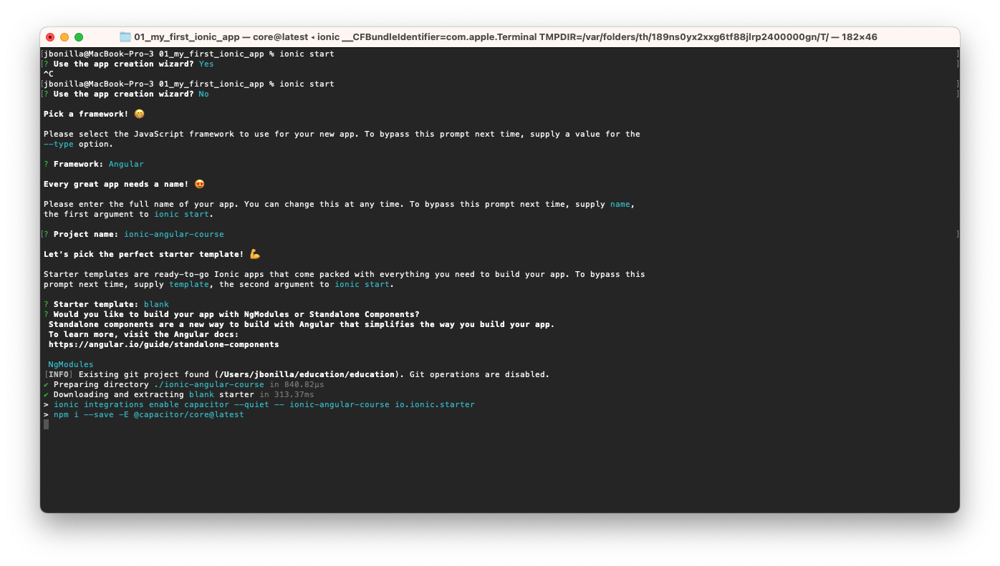
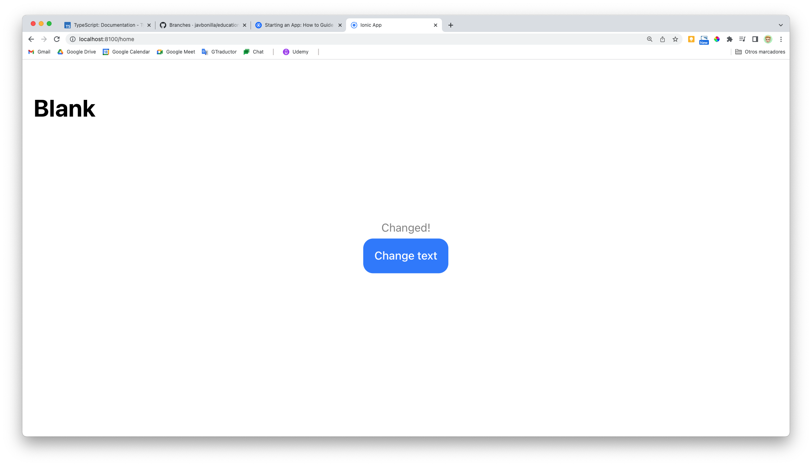

# Ionic

## Getting started

### What's ionic?

[Ionic Framework: The Cross-Platform App Development Leader](https://ionicframework.com/)

Ionic in the end is all about having one codebase which is the codebase for a web app and therefore uses HTML, Javascript and CSS, so what you would use to build normal user interfaces in the web and you use these tools and these techniques and these languages which you already know and take some magic added by Ionic to generate web apps, progressive web apps and iOS and Android apps and if you want, even electron desktop apps.

Electron is a certain technology that allows you to wrap a web app into a desktop app so to say. So you can build an app for different platforms with the same codebase, with minor adjustments.

#### What are Progressive Web Apps (PWAs) ?

Now regarding that progressive web app part, a progressive web app in the end is a normal web app that looks and feels a bit like a native mobile app. It isn't a native mobile app, you don't distribute it through the app stores, it's still a website which you can find via Google and so on.

- It's optimized to be **reliable**, which means it even works offline or parts of it work offline.
- Should be **fast** and give the user an instant feedback upon actions and you also want to have an engaging app which is able to tap into some native device features, like using the location of the user or the camera.
- **Engaging**: with Ionic, you can build such a progressive web app, you can also build a normal web app which isn't particularly fast or which doesn't tap into native device features and you can also though get a real native app out of it, so that you can really target the broadest range of channels possible.

#### The *magic* of Ionic


Ionic in core is a set of **web components**. Web components are techniques, technologies supported by modern browsers which allows you to basically build your own HTML elements that behind the scenes have more complex logic, something like a tabs component where the user can toggle between different tabs. Ionic gives you these functionalities packaged up in a finished, ready-to-use web components and it has a lot of web components you can use.

That is the core of Ionic: this suite of nicely styled, platform-agnostic and automatically adjusting, so that the automatic you'll have to look of the platform you're running on web components which can dump into your web project. So these custom HTML elements could be built by you but with Ionic, you don't have to, you get a finished suite of such web components.

Now these web components therefore are what you can see on the screen but Ionic and the Ionic ecosystem is more than just that because Ionic is not just this suite of components, Ionic is also the name of the company who developed or which developed these components and this company has more than just these component suite, it also works on a tool named **Capacitor**.

Capacitor is essentially a tool that is capable of taking your existing web app and wrapping it into a so-called web view into a native mobile app. So in the end, it gives you a native mobile app that runs your web app inside of it but in a way that is indistinguishable for the user to a normal native app because it is a normal native app, just with a web app included in it but it looks and feels like a regular mobile app which you build with native mobile controls and that's amazing because this allows you to take your web app and convert it into a mobile app easily.

Now if you're a little more experienced in this area you also might know **Cordova** which is a similar tool doing something similar, capacitor is basically a more modern version of that built from the ground up by the people at Ionic who have a lot of experience with that, who used Cordova in the past but now have their own solution which we'll also use in this course which is super fast, super easy-to-use and makes it really easy to build native mobile apps.

So this is the part that allows us to use our web app and run it on a native device as a native mobile app and not just as a website opened in the browser.

Now last but not least, the Ionic platform, so the set of tools we use from the Ionic ecosystem also has the **Ionic CLI** which stands for command line interface, which can work with other CLIs, like in this course the Angular CLI which it will use behind the scenes, which helps us create Ionic projects, manage them, use capacitor to convert our web app into a mobile app, so basically which helps us with the entire build workflow, that is the last important part from the Ionic world we'll be using. These makes developing simply easier, faster and allows us to finally build and package our app up. Now this is the Ionic platform, these are the tools you will learn about in this course in detail and this is just a big picture here obviously and this is what Ionic gives us to build amazing web apps which can work and run as web apps but then they look like native mobile apps already, thanks to these nice Ionic web components which by the way are also not just about the looks but also have a lot of rich functionality included in them, like this tab functionality I mentioned earlier but then Ionic doesn't stop there, doesn't stop at that web user interface, it then also gives you the tool to build that easier and to then also convert it into mobile apps or even desktop apps if you want to. This is the Ionic platform in its core, there also are certain premium and cloud services offered by Ionic, for some of them you have to pay, others are free, I won't dive too much into them in this course but I want to mention nonetheless, these services allow you to build your app in the cloud, for example if you want to build an iOS app on Windows, this would be possible with the services and they also have other services for easier development or previewing and you can find all of that on their official web page which I'll also show you in a second.

But this is Ionic in its core.

### Understanding the Ionic system


Now that we have this detailed first look at what Ionic is and which kind of tools it gives us, let's take a closer look at this Ionic ecosystem and for that, let's go back to our starting point which is that we want to build a web app with or without any framework, so in this course with Angular but you could even build it with vanilla Javascript or with React or Vue, Ionic works with all these alternatives.

So you're building this web app and you want to keep it as a web app, possibly a so-called progressive web app with these cooler features, this fast and reliable interaction and you also want to have a native mobile app and then you have this suite of web components which look like this, which look like normal HTML tags except for that they aren't.

You then have your tools to convert this app and you have your tools for the development, so the Ionic CLI and so on. This is essentially what we saw in the last lecture already but this is just another way of depicting it or of showing it on a slide.


Now of course with that knowledge in mind, we can create an Ionic project and we'll do so in this section already.

Now this project essentially is all about our app, so about our code we write to create a nice web application, a nice website in the end and that of course means we will write our own code and again, that could be written in vanilla Javascript or with any framework like in this course with Angular.

So we add such a front-end framework and that is optional as I just mentioned, you could use vanilla Javascript and then we add the Ionic framework, so this set of Ionic web components to get nice, rich, web elements added to this app automatically or with very little effort, so that the app already looks nice and has a lot of nice capabilities which would be quite a lot of work to build on our own otherwise.

So with that added and with a lot of cool functionalities added therefore, we can continue. Now as a side note because that's already interesting to know here, the web components we're adding here, the Ionic web components are built with a tool called Stencil.

You don't need to learn Stencil to work with Ionic, not at all and we will not learn it in this course but if you want to learn how the Ionic web components were built behind the scenes, so if you want to know a bit more about that or if you want to build your own web components which you can use in conjunction with your framework and with Ionic, then learning Stencil could be well worth it and I do have a complete web component with and without Stencil of course, so all in one course here on Udemy.

So definitely check this out if you want to learn all about the technology the Ionic team used to build their Ionic web components but that's just a side note. So these web components are built with Stencil and that is all done for you, you just add these web components. And in the end, you can then build different kinds of apps based on your single codebase based on your app and this is again done with Capacitor or Cordova as I mentioned, in this course we'll use Capacitor which is a tool developed by the Ionic team, so we'll stay entirely in that Ionic world and what this tool in the end does is it acts as a bridge between our web code, our web Javascript code and then the native platform we're running on. So that from our Javascript code, we can trigger certain functions which then in the end trigger native code on your device, so real native code there to for example open the camera, to get the user location, to show an alert or anything like that, this can then be done with real native code executed on your behalf without you needing to write it by tools like Capacitor or Cordova which you can even use kind of together as I'll also show in this course but we'll primarily use Capacitor here.

So this is what Ionic is all about, in this course we will learn all about Ionic, we will do that with Angular as a front-end framework and we'll also learn about Capacitor and we will then therefore build a progressive web app, as well as our mobile apps. We'll not cover Stencil or anything like that.

### What's Angular?


Now that we had a first look at what Ionic is and no worries if that was a lot, we'll learn about these different building blocks step-by-step throughout the course, we'll learn about the web components and then we'll learn about Capacitor and how that works together, no worries but now that we learned about that, what is Angular? And I want to be honest here, you should know that, knowing Angular is a prerequisite to this course.

There is a complete refresher module after this first module, this is entirely optional and it should really just be a refresher, it will not teach you Angular from the ground up, it will only refresh your knowledge in case it's been some time since you last worked with Angular. Knowing Angular is a prerequisite and if you don't, check out my complete Angular guide to learn all about Angular which you will also need in this course. Angular is of course a framework which makes the development of web apps, Javascript driven web apps easier and more fun and allows us to write more powerful apps because we don't have to focus on the nitty-gritty details but we can use Angular to take care about all the rendering of the UI and of creating a nice single page application and we can focus on our business logic and therefore, tools or frameworks like Angular help us write highly reactive Javascript-driven web apps.

It's absolutely optional, we could do everything with vanilla Javascript but then we really couldn't because we would have to reinvent the wheel all over the place, we would probably introduce bugs and Angular does the same we could do but in a best practice way it makes the way free for us to work and focus on our own business logic. And we also use Angular to build so-called single page applications which are apps that run on the same HTML page, where this page or parts of this page are constantly re-rendered via Javascript, in the end triggered and controlled through Angular but which to the user looks like sometimes the entire page changes and that simply creates the illusion of having different pages we can switch between whilst all the transitions and so on our instant because it's Javascript running in the browser, we don't need to wait for a server response and that's why we build apps with Javascript and why we power so much logic in our apps with Javascript.

Now in an Ionic app, we essentially would want to use a framework like Angular because it helps us with complex problems like state or data management between different pages for example, which can become quite difficult in bigger apps and it helps us with things like routing or navigation, so switching between these different pages and passing data around between them and so on and I will come back to this later in the course.

### Our first Ionic app!

Node.js is required.

[Node JS Download](https://nodejs.org/en/download)

For install Ionic:

``` bash
npm i -g @ionic/cli
```

And this will now install the ionic CLI tooling, globally on your Mac.

So now with that installed, we can use it to build a new app to create a new app for this in your terminal or a command prompt.

``` bash
mkdir 01_my_first_ionic_app
cd 01_my_first_ionic_app
ionic start
```



After Ionic project is created, go to your new project directory:

``` bash
cd ionic-angular-course
```

And simply run `ionic serve` to run the project.

``` bash
ionic serve
```

Now, `ionic serve` will be behind the scenes, as you can see here, actually use the angular CLI, which is installed for you in this project to spin up a development server, which in the end runs your application, builds your angular application, and that's really cool. Ionic uses the angular CLI behind the scenes.

So all the cool features offered by the angular CLI are included in an ionic project as well. And you don't need to wait for the ionic seal to update to include something you might want to use from the angular CLI.

And now we have our first Ionic app!


This is, of course, a responsive app.


And what you find in there in its core is a normal angular app. So if you work with ANGULAR before, which you should for this course, then this does look quite familiar here.

You've got a *source* folder with that folder with the app module app component.

And here in the app component HTML file, we see the first interesting thing.

``` html app.component.html
<ion-app>
  <ion-router-outlet></ion-router-outlet>
</ion-app>
```

These are not normal HTML elements and they're also not normal angular components in the end this year.

Are these web components added by Ionic. Now these are some web components. We can see even more here in your home page HTML file good AI and header toolbar title iron content and then also normal HTML element.

So it is quite normal to mix and match them. Ionic has a rich sute of built in elements which in case you want to get a sneak peek already you can find in the official docs under developer's UI components on ionic framework dot com.

And there you see a list of all the web components it ships with.

And that's quite a lot.

We can do cool things like here. We could add iron button, which is one of the components of chips with and in this course you will learn about a lot.

```html home.page.html
<ion-header [translucent]="true">
  <ion-toolbar>
    <ion-title>
      Blank
    </ion-title>
  </ion-toolbar>
</ion-header>

<ion-content [fullscreen]="true">
  <ion-header collapse="condense">
    <ion-toolbar>
      <ion-title size="large">Blank</ion-title>
    </ion-toolbar>
  </ion-header>

  <div id="container">
    <p>{{text}}</p>
    <ion-button (click)="onChangeText()">Change text</ion-button>
  </div>
</ion-content>
```

So we write normal angular code here. This is a normal angular code and the normal angular click listener. Just the element is not a normal angular or HTML element. It is an Ionic web component.

And then I would add my edit that we added this click listener and I'm targeting on change text, I can add on change text method here to my home page component class, which is a normal angular component. As you can tell, it has to component decorator.

``` ts home.page.ts
import { Component } from '@angular/core';

@Component({
  selector: 'app-home',
  templateUrl: 'home.page.html',
  styleUrls: ['home.page.scss'],
})
export class HomePage {
  text = 'Default starting text';
  constructor() {}
  onChangeText() {
    this.text = 'Changed!';
  }
}
```

Now with that, if I now say this thanks to Ionic serve still running and you should keep this up and running, it will automatically watch your code for changes and reload your app in the browser.

So rebuild the app and then reload the app in the browser whenever such a change happens.

And therefore now if you go to the tab where your app runs, you see the change template.



Ionic automatically adjusts its components to the platform they're running on. It gives you nice styling and you can use them like normal Web elements, like normal HTML elements, just with a lot of functionality already included.

#### Working with VS Code

Recommended extensions:

- Angular essentials
- Ionic official extension
- material icons theme

### The history of Ionic


### How to build native mobile apps with Ionic


There is just one important thing that is important to know about mobile apps built with Ionic.

If you're building such a mobile app as I mentioned, in the end what we get is our code, our Ionic app with tools like Capacitor or Cordova is made available as a mobile app for these native platforms, so for Android and iOS and now we have two common ways of making that happen.

We could compile our code to native code, so we could compile the code to Java for Android or to Objective C or Swift for iOS and compiling here especially talks about the templates, so a button, an ion-button we have in our template could be converted into a real native button or the alternative, we could wrap our web app into a web view. On native mobile apps, you can launch a web view in the application to host a web page inside of that app.

You might know that from some apps like Twitter, if a person links some web page there and you tap it, you don't open your actual browser app and open the page there but inside of Twitter, a built-in browser opens up and this is not a browser developed by the Twitter guys, it's a so-called web view, it's in the end a special widget you can use a native app development, that is a fully fledged browser that doesn't look like one because you don't have a URL bar at the top and so on, it just is a fullscreen browser and that is what Ionic uses. With tools like Capacitor or Cordova, you in the end get a mobile app shell that has such a web view in it and also then has some capabilities of launching a simple web server, running mobile on the device that hosts your Ionic web app inside of that web view and then Cordova and Capacitor, that's the cool thing, also give you a bridge so to say through you can tap into real native device features from inside your web app and that's the difference to a website running in a normal browser, there this is not possible, in a Capacitor app that is. So Ionic takes this approach of wrapping your app into a web view no matter if you are using Capacitor or Cordova.

#### What's a WebView


Now that web view as I mentioned allows you to run your app, a normal web app inside of a native app that renders this full screen browser.

Now you could say that this has to be slower than a compiled app where you work with the real native widgets and technically that would be true, such an app will be a bit smaller because there is this extra wrapper and it is just a web page but it is super important to stress here that modern devices are so fast and an Ionic app typically uses so little performance that you will absolutely not see any difference and then you would just have the advantage of being able to build a cross-platform app with almost no effort at all, that looks and feels like a native app, that also is technically a native app and where you can tap into all the native device features like the camera you might need, just that if you look under the hood, it's not really compiled down to a native mobile app but instead it's wrapped into a native mobile app but again, the performance difference will in 99% of all cases not matter and I do mean it like this, not matter for you and you just reap the benefits.

## Ionic Component Basics

### Core app building blocks


**UI components** these Ionic components are one of the most important building blocks you need in any Ionic app.

**Themes & styles** the look of these components. They look beautiful out of the box, but in your specific application you'll have your own style, your own corporate identity you want to show and you want to use and Ionic does not stop you from doing so, just because the components look good out of the box does not mean you can't style them.

**Navigation** basically means that we want to switch between different pages of our app. Now a page doesn't technically mean a new document fetched from a server, instead you tipically build a so-called single page application where frameworks like Angular or Vue or libraries like React together with React Router drive the change of pages and the rendering of different parts of your app onto the screen and in mobile apps as well, there we also know that concept of tapping something, seeing a new page and then tapping the back button to go back.

Now when we're building a bigger application, there will also be the point of time where we need to take care about **state management** and actually state management plays an important role even in tiny apps but there, it's very simple but the more complex your app gets, the harder state management becomes and state management, just in case you're not sure what this means, really refers to the management of data and information in your running app, something like is the user currently sending a request and should I show a spinner, that would be state or something like a list of loaded products, that would be another form of state. And this is also something where not Ionic directly but frameworks like Angular can help us and therefore we'll also dive into this later in the course.

Now when we leave the web app world and we plan on publishing our Ionic app as a real native app through the apps stores, then we'll have it wrapped in this web view, in this real native app shell and we'll have this bridge to tap into **native device features** like a camera and that is another important building block of Ionic apps. Now admittedly, not so much of web apps, though you can tap into some native device features there as well as you will also learn in this course but mostly in native apps where you can actually access the entire bandwidth of native device features, something like face ID, touch ID or the location of the user and so on, all of that is possible and is made possible not by the Ionic component suite but by capacitor which is also developed by the Ionic team or alternatively, Cordova which is not developed by them but which is supported by Ionic.

The CLI and that holds a port you'll also get for the build workflow and for the publishing workflow of your app, that also is part of the Ionic world and that is also what we'll have a look at later in this course.

### Under the hood of the Ionic components


Now how do we use these components? In a project where we imported this Ionic component library and there are actually different ways of importing it as you will also learn in this course, so in a project where we have this library imported, we have access to this core of Ionic, to these components and we use them just like regular HTML elements and now that is really important to understand if you never worked with web components before, the term might be or will be brand new to you and you might not know how to work with them. Well the thing is you just add them with their tags into your HTML code, in the places where you want to use them, just like regular HTML elements and here is an example, this would be the ion-button, basically a button provided by Ionic which wraps a native normal HTML button and then add some extra styling and extra functionality to it and that's also important. These web components are not just about pre-styled elements, they do add Javascript logic to them as well or at least they can and they often do and then this button here can be configured, it can receive attributes, just as you can set attributes on normal HTML elements. But of course the attributes you can set here and the properties you could set on this button programmatically as well depend on the exact web component you're using because all the things you can configure here, like the fill mode which defines which style of button this is and the color, these are of course things you can configure because the Ionic team made them configurable and the official docs are the place to go to learn which attributes and properties you can set on these web components and I'll guide you through thee docs later in this module. So we use it like a normal HTML element, it supports attributes and properties and these elements can also emit events and that is also quite interesting, you can emit your own events when you are building your own web components and therefore a lot of Ionic components actually also emit customer events to which you can listen, something like a special ion change event for select dropdown for example and we'll see some of these events throughout the course.


[Ionic source code on GitHub](https://github.com/ionic-team/ionic-framework)

### Learn all about the Ionic components

In the official doc, of course

[Ionic UI Components](https://ionicframework.com/docs/components)

### Using basic Ionic components

We want to create a *budget planner* in which annotate the incomes and expenses and compute the total of expenses.

We want to create our application with a mobile app lookstyle, with a **header**, some toolbar at the top which displays the title of the app, something like *budget planner*, and then I want to have the main content below that toolbar where I essentially want to have an input field where I can enter some titles, some names, some description of the expense and then also the value, the amount of the expense, have a button which I can press and then a list below of that where I basically output my expenses and at the very bottom of that and maybe a little sum where I see the total sum of the expenses.

[`ion-app`](https://ionicframework.com/docs/api/app)

[`ion-content`](https://ionicframework.com/docs/api/content)

``` html app.component.html
<ion-app>
  <ion-header>
    <ion-toolbar color="primary">
      <ion-title> Budget Planner </ion-title>
    </ion-toolbar>
  </ion-header>
  <ion-content>
    <ion-card>
      <ion-card-header>
        <ion-card-subtitle>Write a new expense</ion-card-subtitle>
      </ion-card-header>
      <ion-card-content>
        <ion-list>
          <ion-item>
            <ion-input label="Expense reason" labelPlacement="floating" type="text"></ion-input>
          </ion-item>
          <ion-item>
            <ion-input label="Expense amount" labelPlacement="floating" type="number"></ion-input>
          </ion-item>
        </ion-list>
      </ion-card-content>
      <ion-button fill="outline">Save</ion-button>
      <ion-button fill="clear">Clear</ion-button>
    </ion-card>
  </ion-content>
</ion-app>
```

The result is:


### Using the ionic grid

[`ion-grid`](https://ionicframework.com/docs/api/grid)

``` html app.component.html
<ion-app>
  <ion-header>
    <ion-toolbar color="primary">
      <ion-title> Budget Planner </ion-title>
    </ion-toolbar>
  </ion-header>
  <ion-content>
    <ion-grid>
      <ion-row>
        <ion-col size-md="6" offset-md="3">
          <ion-card>
            <ion-card-header>
              <ion-card-subtitle>Write a new expense</ion-card-subtitle>
            </ion-card-header>
            <ion-card-content>
              <ion-list>
                <ion-item>
                  <ion-input label="Expense reason" labelPlacement="floating" type="text"></ion-input>
                </ion-item>
                <ion-item>
                  <ion-input label="Expense amount" labelPlacement="floating" type="number"></ion-input>
                </ion-item>
              </ion-list>
            </ion-card-content>
            <ion-button fill="outline">Save</ion-button>
            <ion-button fill="clear">Clear</ion-button>
          </ion-card>
        </ion-col>
      </ion-row>
    </ion-grid>
  </ion-content>
</ion-app>
```

The result is:

